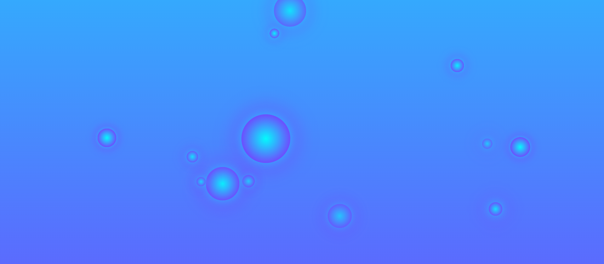

# 🎉 Bubble Animation Theme

A visually appealing and interactive bubble animation effect with a beautiful animated background and interactive click effects. Designed with smooth animations and performance optimizations.

## 🚀 Features

- **Interactive Bubbles:** Click on any animated bubble to trigger a scaling effect and a color change.
- **Beautiful Animated Background:** Dynamic and flowing animated background with smooth transitions.
- **Randomized Effects:** Randomized positions and sizes for each animated bubble.
- **Responsive & Optimized:** Designed for all screen sizes with performance optimizations.
- **Click-to-Interact:** Clicking a bubble triggers an interactive animation.

## ✨ Key Highlights

1. **Randomized Position & Size:** Every bubble has a random position and varying size to make the animation unique.
2. **Click Effect:** Clicking on a bubble triggers a scaling effect followed by shrinking and color transitions.
3. **Smooth Animations:** A smooth scaling effect combined with interactive animations on clicks.
4. **Responsive Design:** Designed to dynamically fit different screen sizes with ease.
5. **Performance Optimizations:** Limits the number of simultaneous bubbles to ensure smooth performance.

## 💻 Technologies Used
- **HTML5**
- **CSS3**
- **JavaScript**

## 🖥️  **Screenshot**

Below is a demo screenshot showcasing the effect:

  

## 📸 Preview Animation

- Click on any random animated bubble to trigger a scaling effect.
- The animated background reacts seamlessly with smooth gradient changes.

## 🛠️ How It Works

1. **Animation Trigger:** Randomly-generated bubbles are created at random intervals at random positions with random sizes.
2. **Click Interactivity:** Clicking on a bubble triggers a scaling effect followed by shrinking and color transitions.
3. **Smooth Fade Out:** The bubbles fade out after the animation ends and are removed from the DOM to improve performance.
4. **Background Animation:** The entire screen has a moving animated gradient as the background.

## 💡 Future Ideas
1. Add new effects, like rotating bubbles.
2. Allow users to change background themes dynamically.
3. Introduce user-configurable animations (e.g., control bubble speed, size, or click effects).

## 🤝 Contributing

We welcome contributions!  
Feel free to fork this repository, open an issue, and submit pull requests to enhance the project.

Happy Coding! ✨👨‍💻
